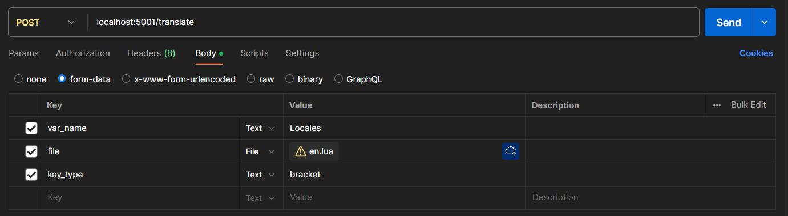

# AI JSON Translator

AI JSON Translator is a Python-based tool designed to facilitate the translation of JSON data structures using OpenAI's GPT models. It provides a streamlined approach to convert JSON content from one language to another, ensuring consistency and accuracy in multilingual applications.

## Running with Docker 🐳

To simplify deployment and ensure consistency across environments, you can run AI JSON Translator using Docker. This approach encapsulates the application and its dependencies within a container, making it easy to set up and run.

---

## Prerequisites 📋

- **Docker**: Ensure that Docker is installed on your system. You can download it from the [official Docker website](https://www.docker.com/get-started).
- **Docker Compose**: This tool simplifies the process of managing multi-container Docker applications. Installation instructions are available on the [Docker Compose GitHub page](https://github.com/docker/compose).

---

## Setting Up the Application with Docker ⚙️

### Clone the Repository

Begin by cloning the AI JSON Translator repository to your local machine:

```bash
git clone https://github.com/tibidata/ai-json-translator.git
cd ai-json-translator
```
### Configure Environment Variables

The application relies on certain environment variables for configuration. An [.env.example](.env.example) file is provided in the repository as a template.

- Duplicate and Rename: Create a copy of .env.example and rename it to .env:

```bash
cp .env.example .env
```

- Edit the `.env` File: Open the `.env` file in a text editor and fill in the required values.

```env
OPENAI_API_KEY=<Your OpenAI API key>
```

Note: The `.env` file is included in [.gitignore](.gitignore) to prevent sensitive information from being committed to version control.

### Review the Docker Configuration
The repository includes a Dockerfile and a docker-compose.yml file. These files define the Docker image and the services required to run the application.

- [Dockerfile](Dockerfile): Specifies the environment and dependencies for the application.
- [docker-compose.yml](docker-compose.yml): Defines the services, networks, and volumes for the application.

Ensure these files are present in the root directory of the cloned repository.

### Build and Start the Docker Containers
Use Docker Compose to build the Docker image and start the application:

```bash
docker-compose up --build
```
This command downloads the necessary base images, installs dependencies, and starts the application in a container.

### Verify the Application is Running
After the containers are up and running, you can verify the status by checking the running Docker containers:

```bash
docker ps
```

You should see a container named ai-json-translator (or a similar name defined in your [docker-compose.yml](docker-compose.yml)) in the list.

### Access the Application
By default, the application is configured to run on port 5001. You can access it via http://localhost:5001/.

- Health Check: Navigate to http://localhost:5001/ to ensure the API is running. You should receive a JSON response indicating success.

- Translate Endpoint: To use the translation feature, send a POST request to http://localhost:5001/translate with the JSON data you wish to translate.

### Access with Postman

- API call (JSON):


- API response (JSON):


- API call (LUA):

```
 PLEASE NOTE:
- You have to provide the name of the global variable containing the data in the var_name variable.
- By default the keys will be reaturned as someKey if you want to use ["someKey"] notation add the key_type = bracket value as seen below.
```




- API response (LUA)


### Stopping the Application
To stop the running containers, execute:

```bash
docker-compose down
```

## Contributors

We appreciate the support from our community and all the developers who have helped shape this project. You can view the full list of contributors on our [GitHub contributors page](https://github.com/tibidata/ai-json-translator/graphs/contributors).

If you’d like to contribute, please check out our [contributing guidelines](https://github.com/tibidata/ai-json-translator/blob/develop/CONTRIBUTING.md) for more details on how you can make a difference.

## License

This project is licensed under the MIT License – see the [LICENSE](https://github.com/tibidata/ai-json-translator/blob/develop/LICENSE) file for details.

## Known Issues

- When providing multiple keys in a global variable only the last keys data is returned